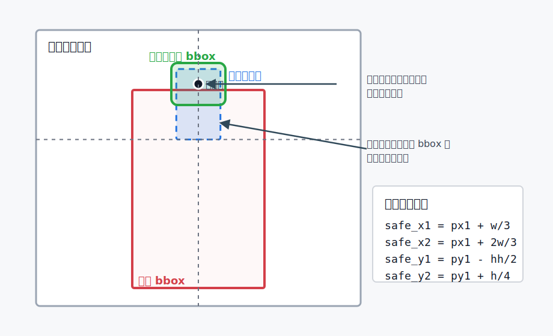
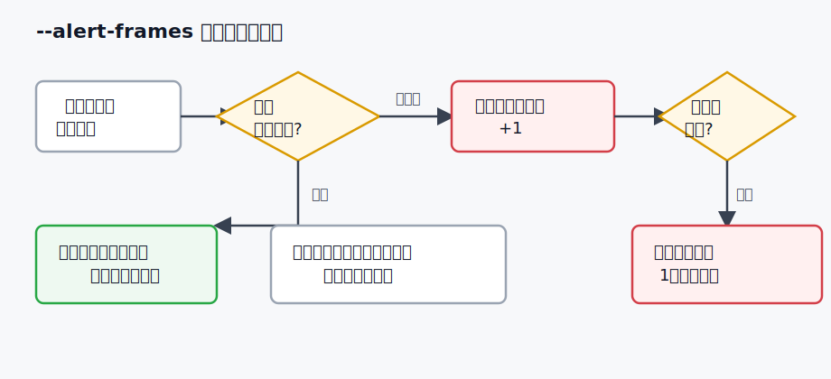

# ヘルメット装着判定ロジック

このドキュメントは、現在のコードで行っているヘルメット装着/未装着判定を図付きでまとめたものです。対象の主なコードは `utils/bbox_utils.py` の `hardhat_is_on()` と、`main.py` の `person_has_hardhat()` / `update_no_helmet_alerts()` です。

## 全体像

現在の判定は、人物とヘルメットを別々に検出したあと、**ヘルメットの中心点が人物の頭部付近にあるか**で装着/未装着を決めています。



処理の流れは次の通りです。

1. `HardhatTracker` がヘルメットの bbox を検出する。
2. `PersonTracker` が人物の bbox を検出する。
3. 人物 bbox の上部中央に「判定エリア」を作る。
4. ヘルメット bbox の中心点がその判定エリア内にあれば装着済みとする。
5. どのヘルメット中心点も入らなければ未装着とする。

## 判定に使う値

人物 bbox を `[px1, py1, px2, py2]`、ヘルメット bbox を `[hx1, hy1, hx2, hy2]` とします。

```text
person_width  = px2 - px1
person_height = py2 - py1
hardhat_height = hy2 - hy1
```

ヘルメットの中心点は次のように計算します。

```text
helmet_center_x = (hx1 + hx2) / 2
helmet_center_y = (hy1 + hy2) / 2
```

## 人物側の判定エリア

現在のコードでは、人物 bbox の上部中央を判定エリアにしています。

```text
safe_x1 = px1 + person_width / 2 - person_width / 6
safe_x2 = px1 + person_width / 2 + person_width / 6
safe_y1 = py1 - hardhat_height / 2
safe_y2 = py2 - person_height * 3 / 4
```

つまり横方向は人物幅の中央 1/3 付近、縦方向は人物の上側 1/4 付近です。`safe_y1` はヘルメットの高さの半分だけ上に広げているため、頭より少し上に出たヘルメット枠も拾いやすくなっています。

## 装着/未装着の決定

`hardhat_is_on()` は、ヘルメット中心点が判定エリア内にあるかを確認します。

```text
safe_x1 <= helmet_center_x <= safe_x2
safe_y1 <= helmet_center_y <= safe_y2
```

この条件を満たすヘルメット bbox が1つでもあれば、その人物は「ヘルメット装着」と判定されます。満たすものがなければ「未装着」です。

## 画面表示での使われ方

`trackers/person_tracker.py` の `draw_frame_bboxes()` では、この判定結果を人物枠の色に使っています。

```text
装着   -> 緑色の人物枠
未装着 -> 赤色の人物枠
```

ヘルメット bbox 自体は `HardhatTracker` 側で緑色の枠として描画されます。

## ターミナル警告での使われ方

`main.py` の `--alert-frames` を指定すると、未装着が連続した人物だけターミナルに通知します。



通知の状態管理は次の2つです。

```text
no_helmet_counts = {人物ID: 未装着で連続検出されたフレーム数}
alerted_ids = すでに通知済みの人物ID
```

動きは次の通りです。

1. 装着済みと判定された人物は、連続未装着カウントをリセットする。
2. 未装着と判定された人物は、人物IDごとにカウントを1増やす。
3. カウントが `--alert-frames` に到達したら、ターミナルに警告を出す。
4. 同じ未装着状態が続く間は、`alerted_ids` により同じ人物への警告を繰り返さない。
5. 人物が画面外に消えたら、カウントと通知済み状態をリセットする。

## 注意点

この判定は「ヘルメットの中心点が人物の頭部付近にあるか」という位置関係ベースの簡易判定です。そのため、次のようなケースでは誤判定が起きる可能性があります。

- 人物同士が近く、別の人のヘルメットが頭部付近に入る場合
- ヘルメット検出 bbox が大きくずれる場合
- 横向き、しゃがみ姿勢、見切れなどで人物 bbox の頭部位置が通常と異なる場合
- ヘルメットが検出されなかった場合

精度を上げる場合は、IoU や距離条件を追加する、姿勢推定で頭部位置を推定する、人物ごとにヘルメットを追跡して紐づける、といった改善が考えられます。
